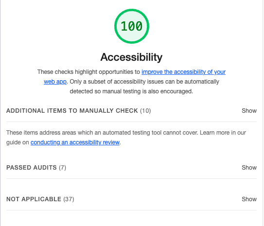

# LAB - 11

## Project Name: Cookie Stand

- Odd Duck Product Co is trying to decide which project from their R&D department they should invest in next to sell. They asked me to make a web page that they can run at a kiosk at the front entrance of their campus. Whenever an employee walks by, the employee can vote for 1 of the 3 products displayed that they think should be the next new product brought to market. After a week of collecting data, they would like some nice graphs to visualize the results.

- To make this data collection project maximally effective, Odd Duck wants me to build an app that displays three potential products side-by-side-by-side, without favoring any single product. I’ll need to manage the size and the aspect ratio of the images.

- As the app’s purpose is to have the staff members choose which product, of the three displayed images, that they would be most interested in seeing as a new creation, I will need to store each anonymous vote, calculate totals, and visually display the results.

- To keep the product selection process as untainted as possible, I have been instructed to not allow any results to be shown to users until there have been a total of 25 selections made.

- The marketing team is not only interested in the total number of clicks, but also the percentage of times that an item was clicked when it was shown. So, I’ll also need to keep track of how many times each image is displayed and do the calculations.

- I am also responsible for the look and feel of the app with custom font, color palette, layout with semantic HTML, and so on.

## Author: Jennifer Dotson

## Lighthouse Accessibility Report

